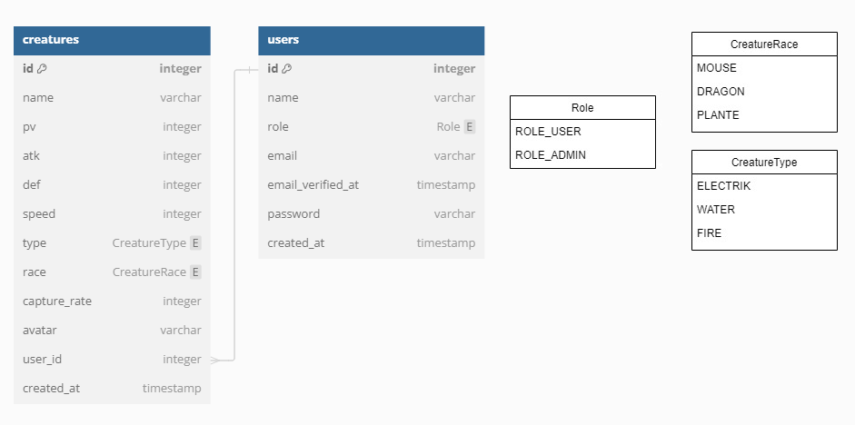

## POKEDEX API
POKEDEX est une application très simple de gestion de bestiaire.
Ce projet est découpé en trois parties, la première consiste à créer un **CRUD** basique des utilisateurs et des créatures.
Ensuite nous ajouterons un système d'authentification et enfin troisième partie, il sera temps de sécuriser notre application en ajoutant des autorisations.

**Fonctionnalités étape 1:**
- Supprimer un utilisateur
- Editer un utilisateur
- Lister les utilisateurs
- Créer une créature
- Supprimer une créature
- Editer une créature
- Lier une créature à un utilisateur

**Fonctionnalités étape 2:**
- Inscription
- Connexion
- Lier une créature créer à l'utilisateur connecté

**Fonctionnalités étape 3:**
- Mise en place des policies pour les utilisateurs
- Mise en place des policies pour les créatures
- Lister les créatures avec des filtres spécifiques

## Designer le modèle des données
Comme avant tout projet nous allons définir les données nécessaires à notre application:


## Créer le projet Laravel11
```
# composer create-project laravel/laravel projet-api --prefer-dist
# php artisan install:api
```

## Lancer le serveur
```
# php artisan serve
```

## Lier la BDD au projet
```
DB_CONNECTION=mysql
DB_HOST=127.0.0.1
DB_PORT=3306
DB_DATABASE=laravel
DB_USERNAME=root
DB_PASSWORD=
```

## Configurer la BDD
```php
// config/database.php
engine => "InnoDB"
```

## Création de la table des créatures
**Document de référence:** https://laravel.com/docs/11.x/migrations  
Nous créons la table `creatures` grâce aux fichier de migrations. Pour cela lancer
la commande suivante `# php artisan make:migration create_creatures_table` puis modifier:
```php
// database/migrations/01_create_creatures_table.php:
<?php
use Illuminate\Database\Schema\Blueprint;
use Illuminate\Support\Facades\Schema;
use Illuminate\Database\Migrations\Migration;

return new class extends Migration {
    public function up(): void
    {
        Schema::create('creatures', function (Blueprint $table) {
            $table->id();
            $table->string('name');
            $table->integer('pv');
            $table->integer('atk');
            $table->integer('def');
            $table->integer('speed');
            $table->integer('capture_rate');
            $table->foreignId('user_id')->constrained()->onDelete('cascade');
            $table->timestamps();
        });
    }

    public function down(): void
    {
        Schema::dropIfExists('creatures');
    }
};
```
Modification de la table user:
```php
// database/migrations/00_create_users_table.php:
$table->string('role');
```

## Ordonner les migrations
Les migrations s'exécute dans l'ordre alphabétique. Ainsi une pratique
courante consiste à utiliser un préfixe numérique pour obtenir l'ordre voulu.
Par exemple: `01_create_entity_name_table.php, 02_create...`
Dans notre cas et afin de satisfaire les liaisons de nos clés étrangères, l'ordre est:
1. User
2. Creatures
3. Les tables systèmes

## Lancer les migrations
```
# php artisan migrate
```

## Créer le modèle des créatures
**Document de référence:** https://laravel.com/docs/11.x/eloquent#eloquent-model-conventions  
```
# php artisan make:model Creature
```
Le modèle est l'interface entre votre base de données et votre backend.
A présent, dans chaque modèle, vous allez préciser comment une table est liée aux autres tables de la base de données.
Par exemple, un utilisateurs a plusieurs créatures et une créature appartient un seul utilisateur.
1. Point de vue du modèle `Creature`: `belongTo` -> **Une créature appartient à un utilisateur**
2. Point de vue du modèle `User`: `hasMany` -> **Un utilisateur à plusieurs créatures**

```php
// Models/Creature.php:
<?php

namespace App\Models;

use App\Enums\CreatureTypeEnum;
use App\Enums\CreatureRaceEnum;
use Illuminate\Database\Eloquent\Factories\HasFactory;
use Illuminate\Database\Eloquent\Model;

class Creature extends Model
{
    use HasFactory;

    /**
     * The attributes that are mass assignable.
     *
     * @var array<int, string>
     */
    protected $fillable = [
        'name',
        'pv',
        'atk',
        'def',
        'speed',
        'type',
        'race',
        'capture_rate'
    ];

    /**
     * Get the attributes that should be cast.
     *
     * @return array<string, string>
     */
    protected function casts(): array
    {
        return [
            'type' => CreatureTypeEnum::class,
            'race' => CreatureRaceEnum::class,
        ];
    }

    public function user()
    {
        return $this->belongsTo(User::class, 'user_id');
    }
}
```

```php
// app/Models/User.php:
<?php

namespace App\Models;

// use Illuminate\Contracts\Auth\MustVerifyEmail;

use App\Models\Creature;
use App\Enums\RoleEnum;
use Laravel\Sanctum\HasApiTokens;
use Illuminate\Database\Eloquent\Factories\HasFactory;
use Illuminate\Foundation\Auth\User as Authenticatable;
use Illuminate\Notifications\Notifiable;

class User extends Authenticatable
{
    use HasFactory, Notifiable, HasApiTokens;

    /**
     * The attributes that are mass assignable.
     *
     * @var array<int, string>
     */
    protected $fillable = [
        'name',
        'role',
        'email',
        'password',
    ];

    // protected $attributes = [
    //     'role' => RoleEnum::ROLE_USER
    // ];

    /**
     * The attributes that should be hidden for serialization.
     *
     * @var array<int, string>
     */
    protected $hidden = [
        'password',
        'remember_token',
    ];

    /**
     * Get the attributes that should be cast.
     *
     * @return array<string, string>
     */
    protected function casts(): array
    {
        return [
            'email_verified_at' => 'datetime',
            'password' => 'hashed',
            // 'role' => RoleEnum::class,
        ];
    }

    public function creatures()
    {
        return $this->hasMany(Creature::class);
    }

    // public function isAdmin()
    // {
    //     return $this->role === RoleEnum::ROLE_ADMIN;
    // }
}
```

## Créer une fabrique de créatures
**Document de référence:** https://laravel.com/docs/11.x/seeding  
**Document de référence:** https://laravel.com/docs/11.x/eloquent-factories  
Les fabriques autrement appelées **factory** sont des sortes « d’usines » à données. Elles vont générer des instances d'un modèle avec des données aléatoires. Les fabriques sont appelées dans des **seeders**. Un seeder est une classe
responsable de la création de données dans la base via la commande `php artisan db:seed`.
Commençons par créer une factory pour nos créatures:
```
# php artisan make:factory CreatureFactory
# php artisan make:factory UserFactory (cette commande echouera car fichier existe déjà)
```
CreatureFactory.php:
```php
<?php

namespace Database\Factories;

use App\Models\User;
use Illuminate\Database\Eloquent\Factories\Factory;

/**
 * @extends \Illuminate\Database\Eloquent\Factories\Factory<\App\Models\Creature>
 */
class CreatureFactory extends Factory
{
    /**
     * Define the model's default state.
     *
     * @return array<string, mixed>
     */
    public function definition(): array
    {
        return [
            'name' => fake()->name(),
            'pv' => random_int(0, 100),
            'atk' => random_int(0, 100),
            'def' => random_int(0, 100),
            'speed' => random_int(0, 100),
            'type' => 'ELECTRIK',
            'race' => 'MOUSE',
            'capture_rate' => random_int(0, 100),
            'user_id' => random_int(1, User::count())
        ];
    }
}
```
DatabaseSeeder.php:
```php
<?php

namespace Database\Seeders;

use App\Models\User;
use App\Models\Creature;
use Illuminate\Database\Seeder;
use Illuminate\Support\Facades\Hash;
use Illuminate\Support\Str;

class DatabaseSeeder extends Seeder
{
    /**
     * Seed the application's database.
     */
    public function run(): void
    {
        User::create([
            'name' => 'Administrateur',
            'role' => 'ROLE_ADMIN',
            'email' => 'admin@pokedex.com',
            'password' => Hash::make('test123'),
            'email_verified_at' => now(),
            'remember_token' => Str::random(10)
        ]);

        User::create([
            'name' => 'Utilisateur',
            'role' => 'ROLE_USER',
            'email' => 'user@pokedex.com',
            'password' => Hash::make('test123'),
            'email_verified_at' => now(),
            'remember_token' => Str::random(10)
        ]);

        User::factory(10)->create();
        Creature::factory(20)->create();
    }
}
```
Le seeder crée deux utilisateurs « en dur » qui nous serviront par la suite à tester le site
sans devoir passer par une inscription manuelle. On appelle ensuite `User::factory` pour créer
10 utilisateurs aléatoires. De même avec `Creature::factory` pour créer 20 créatures aléatoires.

## Remplir la BDD avec les seeders
Maintenant que toutes les factories et seeders sont en place, nous pouvons remplir notre
BDD avec la commande suivante:
```
# php artisan db:seed // lance le seed
# php artisan migrate:fresh --seed // lance la migration + seed
```
**Cette ligne de commande est l’une des plus utilisés dans Laravel car elle permet d'avoir
une BDD remise à zéro et remplie avec des données initiales cohérentes.**

## Gestion des rôles via une énumération
*Rappel sur les énumérations:* Un `enum` est un ensemble de valeurs constantes. Ces différentes valeurs représentent différents *cas*; on les nomme *énumérateurs*. Lorsqu'une variable
est de type énuméré, elle peut avoir comme valeur n'importe quel cas de ce type énuméré.
Dans notre cas, l'enumération `RoleEnum` peut prendre deux valeurs: `ROLE_USER` ou `ROLE_ADMIN`.
Créer dans `App\Enums\RoleEnum.php`:
```php
<?php
namespace App\Enums;

use App\Traits\EnumTrait;

enum RoleEnum: string
{
    use EnumTrait;

    case ROLE_USER = 'ROLE_USER';
    case ROLE_ADMIN = 'ROLE_ADMIN';
}
```
Vous pouvez voir que nous utilisons une classe de trait pour surchargé notre `enum` de quelques
fonctions qui nous seront bien utiles pour plus tard:
```php
<?php
namespace App\Traits;

trait EnumTrait
{
  public static function names(): array
  {
    return array_column(self::cases(), 'name');
  }

  public static function values(): array
  {
    return array_column(self::cases(), 'value');
  }

  public static function array(): array
  {
    return array_combine(self::names(), self::values());
  }

  public static function random(): string
  {
    return self::values()[array_rand(self::values())];
  }

  public static function randomArr(int $maxLength = 3): array
  {
    $randomValues = array_rand(array_flip(self::values()), mt_rand(1, $maxLength));
    return is_array($randomValues) ? $randomValues : [$randomValues];
  }
}
```

## Création d'un CRUD utilisateur
**Document de référence:** https://laravel.com/docs/11.x/controllers  
**Document de référence:** https://laravel.com/docs/11.x/routing  
Utilisez la commande suivante:
```
# php artisan make:controller UserController --model=User --api
```
L'argument `--api` ajoute un « squelette de fonctions » dans
le contrôleur avec des fonctions préétablies à remplir.
Ce squelette expose des routes API RESTful (https://dev.to/mikevarenek/restful-apis-with-laravel-best-practices-811).
Les fonctions de bases sont:
- **index** : renvoie la liste des utilisateurs
- **store** : créer un nouvel utilisateur
- **show** : renvoie les données d’un utilisateur (id en paramètre)
- **update** : modifier un utilisateur (id en paramètre)
- **destroy** : supprimer un utilisateur (id en paramètre)

*Note:* Pour la création/édition ont oublis pas de renseigner le nouveau champs `role` en propriété
"remplissable" dans le modèle `User` via la propriété `fillable` afin que la valeur soit bien affectée lors de l'appel à la fonction `fill`.
```php
<?php

namespace App\Http\Controllers;

use App\Models\User;
use App\Enums\RoleEnum;
use Illuminate\Http\Request;
use Illuminate\Validation\Rule;
use Illuminate\Validation\Rules\Enum;
use Illuminate\Validation\Rules\Password;

class UserController extends Controller
{
    /**
     * Display a listing of the resource.
     */
    public function index()
    {
        return response()->json(User::all());
    }

    /**
     * Store a newly created resource in storage.
     */
    public function store(Request $request)
    {
        $formFields = $request->validate([
            'name' => 'required|string',
            'role' => ['required', new Enum(RoleEnum::class)],
            'email' => ['required', 'string', 'email', 'max:255', Rule::unique('users', 'email')],
            'password' => ['required', 'confirmed', Password::defaults()]
        ]);

        $user = new User();
        $user->fill($formFields);
        $user->save();

        return response()->json($user);
    }

    /**
     * Display the specified resource.
     */
    public function show(User $user)
    {
        return response()->json($user);
    }

    /**
     * Update the specified resource in storage.
     */
    public function update(Request $request, User $user)
    {
        $formFields = $request->validate([
            'name' => 'string',
            'role' => [new Enum(RoleEnum::class)],
            'email' => ['string', 'email', 'max:255', Rule::unique('users', 'email')],
        ]);

        $user->fill($formFields);
        $user->save();

        return response()->json($user);
    }

    /**
     * Remove the specified resource from storage.
     */
    public function destroy(User $user)
    {
        $user->delete();
        return response()->json(['success' => 'success']);
    }
}
```
Pour lier la méthode d'un contrôleur à une route c'est par ici:
```php
// routes/api.php:
Route::get('/users', [UserController::class, 'index'])->name('users.list');
Route::get('/users/{user}', [UserController::class, 'show'])->name('users.show');    
Route::post('/users', [UserController::class, 'store'])->name('users.store');
Route::put('/users/{user}', [UserController::class, 'update'])->name('users.update');
Route::delete('/users/{user}', [UserController::class, 'destroy'])->name('users.destroy');
// autres routes...
```
**Exercice:**
Ecrivez le contrôleur `Creature`. Rassurez vous c'est identique à celui des utilisateurs.
Vous devrez également implémenter les deux énumérations suivantes: `CreatureTypeEnum` et `CreatureRaceEnum`.
Cela va de soit mais pensez à bien tester vos requêtes dans **Postman**.
*Aide à l'exercice:* Vous remplirez le `user_id` avec l'identifiant de votre choix dans **Postman**.
Veillez tout de même à ce que l'identifiant de l'utilisateur existe bien dans la base de données.
*Note:* Les routes dans `routes/api.php` sont sans état et sont affectées au middleware *api*. De plus, le
préfixe url `/api` est automatiquement appliqué à toutes les routes présent dans ce fichier.

## Et si nous ajoutions une image à nos créatures ?
**Document de référence:** https://laravel.com/docs/11.x/requests  
De quoi avons nous besoin ?
1. De sauvegarder l'image sur notre serveur.
2. Ajouter le chemin de l'image sauvegarder dans la table créature.

Déjà commençons par ajouter le champ `avatar`:
```php
$table->string('avatar')->nullable();
```
*Attention:* Veillez à ne pas ajouter la propriété `avatar` en fillable.

Lors de la création:
```php
// validation des données:
'avatar_blob' => 'mimes:jpg,jpeg,png|max:15360'

// si image présente alors enregistrement de l'image sur le disque et du chemin le champs avatar:
if ($request->file('avatar_blob')) {
    $fileName = time() . '_' . $request->avatar_blob->getClientOriginalName();
    $path = 'images/uploads/' . $fileName;
    $creature->avatar = $path;
    $request->avatar_blob->move(public_path('images/uploads'), $path);
}
```
Lors de l'édition même chose ou presque, ont doit simplement ajouter la suppression de l'ancienne image:
```php
// validation des données:
'avatar_blob' => 'mimes:jpg,jpeg,png|max:15360'

// si image présente et ancienne image existe alors suppression de l'ancienne image:
if ($request->file('avatar_blob') && File::exists(public_path($creature->avatar))) {
    File::delete(public_path($creature->avatar));
}

if ($request->file('avatar_blob')) {
    $fileName = time() . '_' . $request->avatar_blob->getClientOriginalName();
    $path = 'images/uploads/' . $fileName;
    $creature->avatar = $path;
    $request->avatar_blob->move(public_path('images/uploads'), $fileName);
}
```

## Rechercher des créatures
Ajout d'une fonction utilitaire de recherches dans le modèle:
```php
static public function search(string $name = null, string $minPv = null, string $maxPv = null)
{
    $query = self::query();

    if ($name) {
        $query->where('name', $name);
    }

    if (is_numeric($minPv)) {
        $query->where('pv', '>', $minPv);
    }

    if (is_numeric($maxPv)) {
        $query->where('pv', '<', $maxPv);
    }

    return $query->get();
}
```
Ont adapte la fonction `index` pour lui ajouter des options de recherches:
```php
public function index(Request $request)
{
    $name = $request->query('name');
    $minPv = $request->query('minPv');
    $maxPv = $request->query('maxPv');

    $creatures = Creature::search($name, $minPv, $maxPv, $page, $limit);
    return response()->json($creatures);
}
```

## Rechercher des créatures - Pagination des données
**Document de référence:** https://laravel.com/docs/11.x/queries  
Nous allons reprendre le code de notre fonction `search` et simplement lui ajouter quelques options
de paginations. Dans la fonction `search` du modèle:
```php
static public function search(string $name = null, string $minPv = null, string $maxPv = null, int $page = null, int $limit = null)
{
    $query = self::query();

    if ($name) {
        $query->where('name', $name);
    }

    if (is_numeric($minPv)) {
        $query->where('pv', '>', $minPv);
    }

    if (is_numeric($maxPv)) {
        $query->where('pv', '<', $maxPv);
    }

    $totalResults = $query->count();
    $query->orderBy('id', 'ASC');

    if ($page && $limit) {
        $query->skip(($page - 1) * $limit)->take($limit);
    }

    return ['creatures' => $query->get(), 'totalResults' => $totalResults];
}
```
Nouvelle route dédiée à la pagination nommée `paginate`:
```php
public function paginate(Request $request)
{
    $page = $request->query('page', 1);
    $name = $request->query('name');
    $minPv = $request->query('minPv');
    $maxPv = $request->query('maxPv');
    $limit = 3;

    $results = Creature::search($name, $minPv, $maxPv, $page, $limit);
    $maxPages = ceil($results['totalResults'] / $limit);

    return response()->json([
        'creatures' => $results['creatures'],
        'maxPages' => $maxPages,
        'page' => $page
    ]);
}
```

## Lister les créatures d'un utilisateur
Pour cela, nous allons créer une nouvelle fonction dans notre contrôleur:
```php
public function indexByUser(User $user = null)
{
  $creatures = DB::table('creatures')->where('user_id', '=', $user->id)->get();
  return response()->json($creatures);
}

// route:
Route::get('/creatures-by-user/{user}', [CreatureController::class, 'indexByUser'])->name('creatures.list-by-user');
```

## Mise en place de l'authentification
**Document de référence:** https://laravel.com/docs/11.x/sanctum#spa-authenticating  
Ajouter les variables d'environnements suivantes:
```
SANCTUM_STATEFUL_DOMAINS=localhost:8000 # url du front-end
SESSION_DOMAIN=localhost
```
Ajout du middleware d'authentification dans `bootstrap/app.php`:
```php
->withMiddleware(function (Middleware $middleware) {
    $middleware->statefulApi();
})
```
Modifier la config du cors:
```
# php artisan config:publish cors // modifier supports_credentials: true dans cors.yaml
```
*Note pour le coté frontend:*
De plus, vous devez activer des options sur l'instance globale de votre application `axios`. En règle générale, cette opération doit être effectuée dans `ressources/js/bootstrap.js`. Si vous n'utilisez pas Axios pour effectuer des requêtes HTTP à partir de votre interface, vous devez effectuer la configuration équivalente sur votre propre client HTTP:
```js
axios.defaults.withCredentials = true;
axios.defaults.withXSRFToken = true;
```

## Création des routes d'authentification
**Document de référence:** https://laravel.com/docs/11.x/authentication  
```php
<?php

namespace App\Http\Controllers;

use App\Http\Controllers\Controller;
use Illuminate\Http\Request;
use Illuminate\Support\Facades\Auth;

class AuthController extends Controller
{
    /**
     * Handle an incoming authentication request.
     */
    public function authenticate(Request $request)
    {
        $credentials = $request->validate([
            'email' => 'required|email',
            'password' => 'required'
        ]);

        $remember = $request->has('remember-me');

        if (Auth::attempt($credentials, $remember)) {
            $request->session()->regenerate();
            return response()->json(['user' => Auth::user()]);
        }

        return response()->json(['user' => null], 401);
    }

    /**
     * Destroy an authenticated session.
     */
    public function logout(Request $request)
    {
        Auth::logout();

        $request->session()->invalidate();
        $request->session()->regenerateToken();

        return redirect()->route('home');
    }
}
```

## Gestion des routes authentifiées
Maintenant que nous avons un système d'authentification fonctionnel nous allons en profiter
pour gérer les autorisations des routes qui nécessite d'être connecté. Dans le cas ou l'utilisateur
tente d'accéder sans permissions l'API répondra par un code HTTP `401`.
```php
// Dans l'exemple ci-dessous, nous autorisons tous les utilisateurs connectés à
// accéder aux routes suivantes.
// Les utilisateurs non connectés recevrons une erreur 401.

Route::middleware(['auth:sanctum'])->group(function () {
    Route::get('/users', [UserController::class, 'index'])->name('users-list');
    Route::get('/users/{user}', [UserController::class, 'show'])->name('users-show');
    Route::post('/users', [UserController::class, 'store'])->name('users-store');
    Route::put('/users/{user}', [UserController::class, 'update'])->name('users-update');
    Route::delete('/users/{user}', [UserController::class, 'destroy'])->name('users-destroy');    
});
```
*Note:* L'accès à l'utilisateur connecté se fait simplement via `Auth::user();`.  
**Exercice:** Faites pareil pour le `CreatureController`.

## Des url plus pratiques pour gérer l'utilisateur connecté
Dans `Models\User.php`:
```php
public function resolveRouteBinding($value, $field = null): ?self
{
  return $value === 'me' ? Auth::user() : parent::resolveRouteBinding($value, $field);
}
```
A présent, vous pouvez essayer la requête `/api/creatures-by-user/me`.
Laravel détecte la chaine de caractère `me`, injecte l'utilisateur connecté et récupère ses créatures.

## Gestion des droits utilisateurs
**Document de référence:** https://laravel.com/docs/11.x/authorization  
La gestion des droits utilisateurs aussi appelées `policies` est gérer dans des fichiers séparés.
C'est ici que des vérifications de permissions dépendant du rôle vont intervenir.

Pour commencer, ajoutons une petite fonction utilitaire dans `Models/User.php`:
```php
public function isAdmin()
{
    return $this->role === RoleEnum::ROLE_ADMIN;
}
```
Création de la `policy` des utilisateurs:
```
# php artisan make:policy UserPolicy
```
Modification du fichier avec les règles que vous souhaitez.
Ici par exemple, seul l'administrateur peut créer un utilisateur, l'édition est possible pour l'administrateur
et la personne connecté. Pareil pour la suppression.
```php
public function store(?User $user, User $userTarget)
{
    if ($user->isAdmin()) {
        return true;
    }

    return false;
}

public function update(?User $user, User $userTarget)
{
    if ($user->isAdmin()) {
        return true;
    }

    return $user->id == $userTarget->id;
}

public function destroy(User $user, User $userTarget)
{
    if ($user->isAdmin()) {
        return true;
    }

    return $user->id == $userTarget->id;
}
```

Ajout de quelques fonctions dans le contrôleur de base pour avoir accès à la fonction `authorize`:
```php
abstract class Controller
{
    use AuthorizesRequests, ValidatesRequests;
}
```

Appel des fonctions de la `policy` dans le contrôleur:
```php
public function destroy(User $user)
{
    $this->authorize('destroy', $user); // ici redirection vers 403 si policy non validée
    $user->delete();
    return response()->json(['success' => 'success']);
}
```
**Exercice:** Faites pareil pour les autres fonctions du contrôleur.

## Fin du chapitre
**Exercice:** Implémenté une inscription (basique sans e-mail de vérification)
Veillez à vérifier si l'email n'existe pas déjà dans la base de données avant de
créer l'utilisateur. Le mot de passe doit également correspondre au critère de sécurité
classique actuel. En cadeau, un lien vers la doc qui vous explique comment
utiliser les fonctions d'accès à la base de donnée: https://laravel.com/docs/11.x/database

## Travaux de groupes et idées d'améliorations
A vous de jouer, ajouter les améliorations que vous voulez, une seule limite:
Votre imagination !

## Ressources
1. https://dev.to/mikevarenek/restful-apis-with-laravel-best-practices-811
2. https://github.com/PokeAPI/pokeapi