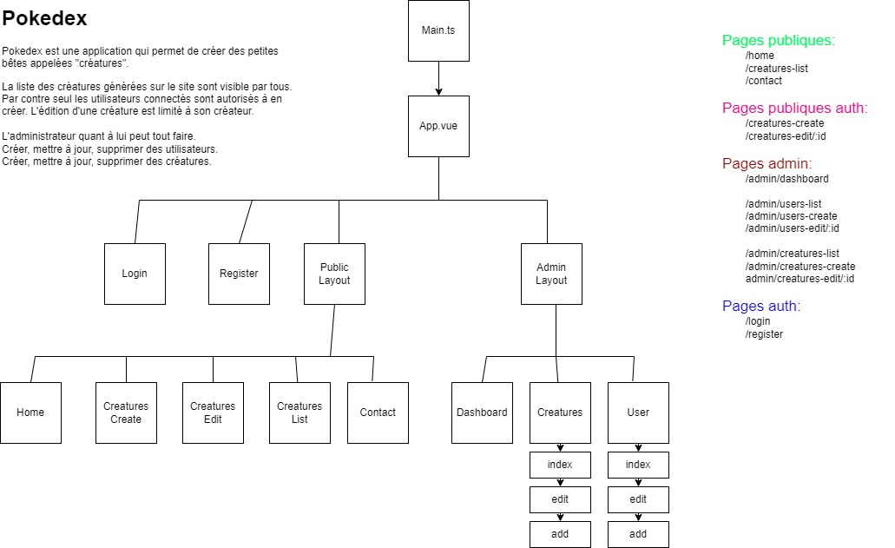

## POKEDEX SPA
**Document de référence:** https://vuejs.org/guide/introduction  
Bienvenue dans la suite du cours sur la création d'une API. A présent nous allons étudier
la partie visuelle de cette application avec le framework **VueJS3** !
```
# npm create vue@latest projet-spa
# npm install --save pinia
# npm install --save axios
```

## Designer l'arborescence des composants
La création d'un diagramme de composants est au front ce que le MCD est au back.
C'est une étape cruciale qui permet de découper la logique applicative en composants.
Vous trouverez un diagramme complet ci-dessous avec en prime
la définition des routes.

**Lien vers la maquette:** https://www.figma.com/design/lkakTItBmH3czPvZZyIV2N/Untitled?node-id=0-1&t=ooV6SNgpjQEMLiTb-1   

## Nettoyer le composant racine
```ts
// App.ts
<script setup lang="ts">
import { RouterLink, RouterView } from 'vue-router'
</script>

<template>
  <header>
    <h1>Pokedex</h1>
  </header>
  <RouterView />
</template>
```

## Créations des composants
**Document de référence:** https://vuejs.org/guide/essentials/template-syntax.html  
**Document de référence:** https://vuejs.org/guide/essentials/forms.html  
La vue du *layout publique*:
```ts
// views/public/Layout.vue
<script setup lang="ts">
import PublicNav from '@/components/PublicNav.vue';
</script>

<template>
  <div class="public">
    <PublicNav />
    <router-view />
  </div>
</template>
```

Un composant de navigation commun à nos vues dans le *layout publique*:
```ts
// components/PublicNav.vue
<script setup lang="ts">
import { computed } from 'vue';
import router from '@/router';
</script>

<template>
  <div class="navs">
    <nav>
      <router-link to='/'>Accueil</router-link> |
      <router-link to='/creatures'>Creatures</router-link> |
      <router-link to='/contact'>Contact</router-link> |
      <router-link to='/admin/dashboard'>Admin</router-link>
    </nav>
    <nav class="nav-auth">
      <router-link to='/login'>Connexion</router-link> |
      <button>Déconnexion</button> |
    </nav>
  </div>
</template>

<style>
img {
  position: absolute;
  right: 30px;
  height: 50px;
}

.navs {
  display: flex;
}

.nav-auth {
  margin-left: auto;
}
</style>
```

La vue *publique home*:
```ts
// views/public/Home.vue
<script setup lang="ts"></script>
<template>
  <div>
    Home works !
  </div>
</template>
```

La vue *publique creatures*:
```ts
// views/public/Creatures.vue
<script setup lang="ts"></script>
<template>
  <div>
    Creatures works !
  </div>
</template>
```

La vue *publique contact*:
```ts
// views/public/Contact.vue
<script setup lang="ts"></script>
<template>
  <div>
    Contact works !
  </div>
</template>
```

Et ont regroupe tout dans un fichier `index.ts` pour faciliter l'importation:
```ts
// views/public/index.ts
import Home from './Home.vue'
import Creatures from './Creatures.vue'
import Contact from './Contact.vue'
import PublicLayout from './Layout.vue'

export {
  Home, Creatures, Contact, PublicLayout
}
```

La vue *login* complétée: 
```ts
// views/auth/Login.vue
<script setup lang="ts">
import { ref } from 'vue';
import router from '@/router';
import * as AccountService from '@/_services/account.service';

const user = ref({
  email: '',
  password: ''
});

async function login() {
    console.log('logic of login here', user);
</script>

<template>
  <div>
    <form @submit.prevent="login">
      <h2 class="form-title">Connexion</h2>
      <div class="form-group">
        <label for="user_email">Email</label>
        <input type="text" id="user_email" v-model="user.email" />
      </div>
      <div class="form-group">
        <label for="user_password">Mot de passe</label>
        <input type="text" id="user_password" v-model="user.password" />
      </div>
      <div class="form-group">
        <button type="submit" class="button">Connexion</button>
      </div>
    </form>
  </div>
</template>

<style>
form {
  max-width: 300px;
  margin: 0 auto;
}
.form-title {
  text-align: center;
  border-bottom: 1px black solid;
  margin-bottom:10px;
}
.form-group {
  display: flex;
  justify-content: space-between;
  margin-bottom: 8px;
}
</style>
```
**Exercice:**
Je ne vais pas détailler tous les composants ici. C'est un peu trop long.
A vous de jouer pour la vue d'ajout d'une créature et la partie admin.
*Note:* Ne coder pas les composants, créer simplement des composants à vide dans un premier
temps. Veillez à bien respecter l'arborescence et le wireframe.

## Création des routes
**Document de référence:** https://router.vuejs.org/guide/  
```ts
// router/index.ts
import { createRouter, createWebHistory } from 'vue-router';
// -------------------------------------------------------------
import * as Public from '@/views/public';
import Login from '@/views/auth/Login.vue';

const router = createRouter({
  history: createWebHistory(import.meta.env.BASE_URL),
  routes: [
    {
      path: '/',
      name: 'public',
      component: Public.PublicLayout,
      children: [
        { path: '', name: 'home', component: Public.Home },
        { path: 'creatures', name: 'creatures', component: Public.Creatures },
        { path: 'contact', name: 'contact', component: Public.Contact }
      ]
    },
    {
      path: '/login', name: 'Login', component: Login
    },
    {
      path: '/:pathMatch(.*)*', redirect: '/'
    }
  ]
});
```
**Exercice:**
Ajouter les composants créer précédemment dans les routes.

## Créer le modèle des créatures
Ce modèle corresponds à ce que notre API renvoie comme données.
C'est souvent (pour ne pas dire tout le temps) un copier/coller du modèle back.
```ts
// _models/Creature.ts
import { CreatureType, CreatureRace } from './Enums';

export interface Creature {
  id: number;
  name:string;
  pv: number;
  atk: number;
  def: number;
  speed: number;
  capture_rate: number;
  type: PokemonType;
  race: PokemonRace;
  avatar: string;
  // avatar_blob?: File;
  user_id: number;
};
```
**Exercice:**
Faites de même avec le modèle `User`.

## Configuration de Axios
**Document de référence:** https://axios-http.com/docs/intro  
**Axios** est une librairie qui se présente comme un `fetch` sur vitaminé.
Autrement dit, c'est une surcouche à `fetch` qui est spécialement conçu pour nous faciliter la vie.
```ts
// _services/CallerService.ts
import axios from 'axios';
import router from '@/router';

const Axios = axios.create({
  baseURL: 'http://localhost:8000/api'
});

export default Axios;
```

## Créer le service des créatures
Un service sert avant tout à éviter la **répétition du code** en encapsulant du code qui se répète
dans une classe. Il devient alors facile de ré-utiliser cette classe partout ou cela est nécessaire.
De manière générale, si vos composants métiers ont du code semblable (parfaitement identique),
alors c'est qu'il vous faut un service. En front les services sont souvent des classes qui
font des appels **AJAX** à l'API car nous avons besoins de ces appels partout dans notre applications.
Cependant leurs usages ne se limite pas à cela.
Voici le service `CreatureService` pour l'exemple:
```ts
// _services/CreatureService.ts
import Axios from './Caller.service'
import type { Creature } from '@/_models/Creature';

export async function getCreatures(): Promise<Creature[]> {
  const res = await Axios.get('/creatures');
  return res.data;
}

export async function getCreature(id: number): Promise<Creature> {
  const res = await Axios.get('/creatures/' + id);
  return res.data;
}

export async function createCreature(creature: Creature): Promise<Creature> {
  const res = await Axios.post('/creatures', creature, {
    headers: { 'Content-Type': 'multipart/form-data' }
  });

  return res.data;
}

export async function updateCreature(creature: Creature): Promise<any> {
  const res = await Axios.post('/creatures/' + creature.id, { ...creature, _method: 'PUT' }, {
    headers: { 'Content-Type': 'multipart/form-data' }
  });

  return res.data;
}

export async function deleteCreature(id: number): Promise<any> {
  return await Axios.delete('/creatures/' + id);
}
```
**Exercice:**
Faites de même avec le modèle `User`.

## Affichage des créatures
**Document de référence:** https://vuejs.org/guide/essentials/conditional.html  
**Document de référence:** https://vuejs.org/guide/essentials/list.html  
La récupération et l'affichage des **ressources d'api** se fait grâce à 3 éléments clés:
1. La création d'une variable réactive.
2. Nous chargeons ensuite les données dans le *hook* du cycle de vie `onMounted`
3. Affichage de la variable réactive avec v-for

```ts
<script setup lang="ts">
import { ref, onMounted, computed } from 'vue';
import type { Creature } from '@/_models/Creature';
import * as CreatureService from '@/_services/Creature.service';

const creatures = ref(new Array<Creature>);

onMounted(async () => {
  creatures.value = await CreatureService.getCreatures();
});

const comptage = computed(() => {
  return (creatures.value.length == 0) ? ' Aucune créature chargées ' : ` Il y a ${creatures.value.length} créatures`
});
</script>

<template>
  {{ comptage }}
  <div v-for="creature in creatures">
    {{ creature.name }}
  </div>
</template>
```
**Exercice:** Créer un système de pagination dans le listing.

## Mise en place de la traduction
**Document de référence:** https://vue-i18n.intlify.dev/  
```
# npm i --save vue-i18n@9
# mkdir locales
# cd locales
# touch fr.json
# touch en.json
```

Modification de la configuration de *TypeScript* dans `tsconfig.json`:
```
// dans compilerOptions, ajouter:
"resolveJsonModule": true,
```

Initialisation de la lib `vue-i18n` dans `main.ts`:
```ts
import { createI18n } from 'vue-i18n';
import fr from './locales/fr.json';
import en from './locales/en.json';

// configure i18n
const i18n = createI18n({
  locale: 'fr',
  fallbackLocale: 'fr',
  messages: { fr, en }
});

// create and start the app
const app = createApp(App);
app.use(i18n);
app.mount("#app");
```

Il n'y a plus qu'a utiliser la fonction `$t` pour insérer nos traductions comme ci-dessous, facile !
```
{{ $t("CREATURE.CREATE") }}
```

## Ressources
1. https://pokepalettes.com/